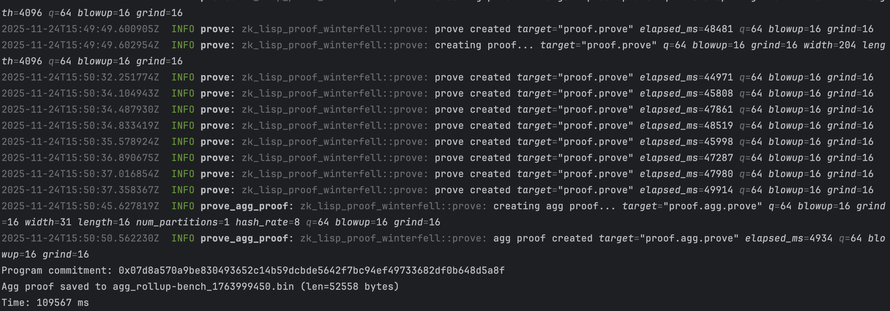

# ZK Lisp


*Copyright (c) Andrei Kochergin. All rights reserved.*

A small Lisp-like DSL and compiler for proving program
execution in zero-knowledge. Source code is compiled to
a register-based VM whose execution trace is proven using
the Winterfell STARK prover and verified with its verifier.

> [!WARNING]
> Experimental and unaudited; not production-ready.

> [!IMPORTANT]
> This program comes with ABSOLUTELY NO WARRANTY;
> This is free software, and you are welcome to
> redistribute it under certain conditions;

> [!NOTE]
> ZK Lisp targets at least 128-bit conjectured
> security in release, and 64-bit in debug builds.

## How it works

Parse source > AST > IR > VM ops

The trace builder executes VM ops into a fixed-shape
trace. AIR is predefined, you don't write constraints.
Winterfell proves the trace satisfies AIR.

## Features

* Small, Lisp-like DSL with typed functions, safe
  arithmetic helpers, and explicit public/secret arguments.
* Register-based VM with RAM, Merkle, Poseidon2 sponge,
  ROM accumulator and schedule gates.
* Backend-agnostic proof core with traits for
  plugging in different STARK backends.
* Production-style Winterfell-based backend with preflight
  modes and detailed constraint tracing.
* Multi-segment execution proofs: one program split into
  true segments with per-segment VM/RAM/ROM boundaries.
* Parallel step proving with bounded concurrency and
  adaptive partitioning for large traces.
* Strict STARK-in-STARK aggregation AIR that chains child proofs.
* CLI with `run`, `prove`, `verify`, `repl` commands.
* Interactive REPL with `:prove` / `:verify` built-ins.

## Roadmap

* Richer type system: vectors, structs and user-defined records,
  with a stable ABI for host<->VM arguments.
* Property-based and fuzz testing of the DSL, VM, AIR,
  RAM/ROM gadgets and recursion pipeline.
* More real-world examples and templates (rollup STFs,
  Merkle-based apps, benchmarks) with step-by-step docs.
* Documentation site with design notes and an online
  REPL backed by a demo prover.
* Incrementally verifiable computation (IVC) and folding
  schemes built on top of the existing aggregation AIR.
* Program events and structured logs bound into proofs
  to make integration with external systems easier.
* Cross-program invocations and composable proofs
  between multiple zk-lisp programs.
* Pluggable hash suites and additional STARK backends,
  while keeping the core DSL and VM backend-agnostic.

## Quickstart

Run:

```bash
cargo run --bin zk-lisp -- \
  run examples/hello-zk.zlisp \
    --arg u64:2 --arg u64:5 --secret u64:3
```

Prove:

```bash
cargo run --bin zk-lisp --release -- \
  prove examples/hello-zk.zlisp \
    --out ./proof.bin \
    --arg u64:2 --arg u64:5 --secret u64:3
```

Verify:

```bash
cargo run --bin zk-lisp --release -- \
  verify ./proof.bin examples/hello-zk.zlisp \
    --arg u64:2 --arg u64:5
```

*If you pass another args verification will fail.*

### Examples

#### Hello zkSTARKs

```lisp
(def (main pub_x pub_y)
  (let ((s (secret-arg 0)))
    (assert (= pub_y (+ pub_x s)))
    1))
```

#### Simple state transition function (STF)

```lisp
(def N_ACCOUNTS       8)
(def N_TXS            16)
(def HASH_BALANCES_IV 12345)

(def (init_state)
  (loop :max N_ACCOUNTS ((i 0))
    (begin
      (store i 0))
    (recur (+ i 1)))
  (loop :max N_TXS ((i 0))
    (let ((base (+ (tx_base) (* i 4))))
      (begin
        (store base       0)   ;; from
        (store (+ base 1) 1)   ;; to
        (store (+ base 2) 1)   ;; amount
        (store (+ base 3) 0))) ;; fee
    (recur (+ i 1))))

(def (tx_base)
  N_ACCOUNTS)

(def (tx_from i)
  (load (+ (tx_base) (* i 4))))

(def (tx_to i)
  (load (+ (tx_base) (+ 1 (* i 4)))))

(def (tx_amount i)
  (load (+ (tx_base) (+ 2 (* i 4)))))

(def (tx_fee i)
  (load (+ (tx_base) (+ 3 (* i 4)))))

(def (apply_tx i)
  (let ((from (tx_from i))
        (to   (tx_to i)))
    (begin
      (store from
        (safe-sub (load from)
                  (safe-add (tx_amount i) (tx_fee i))))
      (store to
        (safe-add (load to) (tx_amount i)))
      (tx_fee i))))

(def (apply_batch)
  (loop :max N_TXS ((i 0) (fee_sum 0))
    fee_sum
    (recur (+ i 1) (safe-add fee_sum (apply_tx i)))))

(def (hash_balances)
  (loop :max N_ACCOUNTS ((i 0) (h HASH_BALANCES_IV))
    h
    (recur (+ i 1) (hash2 h (load i)))))

(typed-fn main ((let u64) (let u64)) -> u64)
(def (main expected_fee_sum expected_root)
  (begin
    (init_state)
    (let ((fee_sum (apply_batch))
          (root    (hash_balances)))
      (begin
        (assert (= fee_sum expected_fee_sum))
        (assert (= root expected_root))
        root))))
```

### Performance Benchmarks

<details>
  <summary>Simple state transition function (STF)</summary>

* Apple Silicon M3 Max Configuration: max_concurrent_segments=8
* Stark Parameters: blowup=16, grind=16, q=64, rows=65536

```bash
cargo run -p zk-lisp-cli --release -- prove examples/rollup-bench.zlisp --arg u64:10 --arg u64:12345 --log-level info
```

Trace generation and proof aggregation times for multi-segment execution:

  
</details>

## Testing

```bash
cargo run tests --release
```

## License

This project is licensed under the GNU Affero
General Public License v3.0 or any later version.

See LICENSE for details.