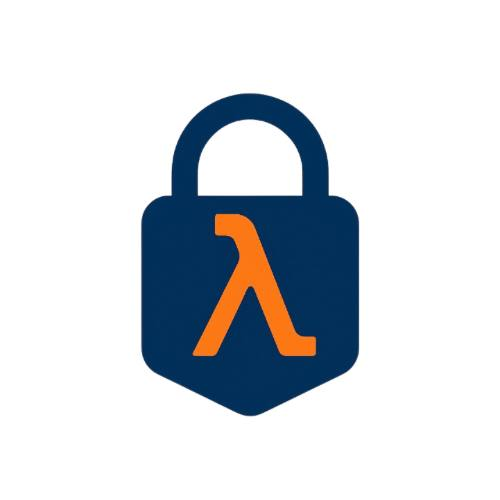

# ZK Lisp



*Copyright (c) Andrei Kochergin. All rights reserved.*

A small Lisp-like DSL and compiler for proving program
execution in zero-knowledge. Source code is compiled to
a register-based VM whose execution trace is proven using
the Winterfell STARK prover and verified with its verifier.

> [!WARNING]
> Experimental and unaudited; not production-ready.

> [!IMPORTANT]
> This program comes with ABSOLUTELY NO WARRANTY;
> This is free software, and you are welcome to
> redistribute it under certain conditions;

## How it works

Parse source > AST > IR > VM ops

The trace builder executes VM ops into a fixed-shape
trace. AIR is predefined, you don't write constraints.
Winterfell proves the trace satisfies AIR.

### Example

```lisp
(def (main x y)
  (let ((s (secret-arg 0)))
    (assert (= y (+ x s)))
    1))
```

## Features

* Backend-agnostic Lisp DSL compiler and virtual machine
* Abstract traits for plugging in multiple STARK backends
* Winterfell-based STARK implementation
* Strict STARK-in-STARK recursion (aggregated proofs)
* zk-lisp CLI with run | prove | verify | repl commands
* Interactive REPL with :prove and :verify built-ins

## Roadmap

* Property and fuzz test coverage
* Complex types such as vector, struct and tuple
* Examples and templates
* Website, documentation and online REPL
* Program events and logs
* Cross-program invocations

## Quickstart

Run:

```bash
cargo run --bin zk-lisp -- \
  run examples/hello-zk.zlisp \
    --arg u64:2 --arg u64:5 --secret u64:3
```

Prove:

```bash
cargo run --bin zk-lisp --release -- \
  prove examples/hello-zk.zlisp \
    --out ./proof.bin \
    --arg u64:2 --arg u64:5 --secret u64:3
```

Verify:

```bash
cargo run --bin zk-lisp --release -- \
  verify ./proof.bin examples/hello-zk.zlisp \
    --arg u64:2 --arg u64:5
```

*If you pass another args verification will fail.*

## Testing

```bash
cargo run tests --release
```

## Donation

The best way to contribute and speed up the release of features and bug fixes,
and possibly even conduct at least a partial security audit, is to provide
financial support to the author.

* **Bitcoin (taproot):** bc1ptere63tyqms6erw6hl9zpxwcuvnw4434f7eshem4l98tg6vl7xpqazjma7
* **ZCash:** t1LKxwJ64yJN7GKbp63JjUjWfgwuaVyjW88
* **Solana:** 2hZ1f7A64vXAThiJLX8pHRBpdEKdSoEEBxree4Cd4PNK
* **Ethereum:** 0xe22a269a1bc55036d949090c87070417e3d03431

For grants and sponsorship offers text to <a href="mailto:zeek@tuta.com">zeek@tuta.com</a>.

## License

This project is licensed under the GNU Affero
General Public License v3.0 or any later version.

See LICENSE for details.